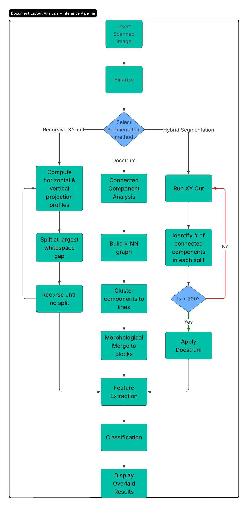

# DocVision

## 1. Project Overview

DocVision is a Streamlit‐based inference UI for document layout analysis.
It supports three segmentation methods (XY‑Cut, DocStrum, Hybrid) with LightGBM classification and an Faster R‑CNN detector.

## 2. Dataset

* **DocLayNet Core & Extra** (COCO format)
* **Link**: [DocLayNet](https://github.com/DS4SD/DocLayNet)
* We pull sample images for inference only in `UI/test_images/`.
* **Full dataset** is large (∼28 GB) and should be downloaded separately if you need to train or evaluate on the full set.

## 3. Saved Models

* **LightGBM** (`.pkl`, < 100 MB): included in repo under `Classification/`.
* **Faster R‑CNN** (`.pth`, > 100 MB): hosted on Hugging Face at
  [`https://huggingface.co/pmodi08/DocVision-Models`](https://huggingface.co/pmodi08/DocVision-Models)
* The code automatically downloads them at runtime using `huggingface_hub`.

## 4. Setup & Clone Repo

To get started:

```bash
git clone https://github.com/Prahar08modi/DocVision.git
cd DocVision
```

## 5. Docker Container (Preferred)

1. **Build** the Docker image:

   ```bash
   docker build -t docvision:latest .
   ```
2. **Run** the container (no HF token needed for public repo):

   ```bash
   docker run -it --rm \
     -p 8501:8501 \
     docvision:latest
   ```
3. **Persist** HF cache between runs (optional):

   ```bash
   docker run -it --rm \
     -p 8501:8501 \
     -v ~/.cache/huggingface:/root/.cache/huggingface \
     docvision:latest
   ```

## 6. Inference UI (Local Alternative)

If you prefer not to use Docker, you can run locally:

1. **Install** dependencies:

   ```bash
   pip install -r requirements.txt
   ```
   Contents of `requirements.txt`:

    ```
    opencv-python
    matplotlib
    torchvision
    streamlit
    joblib
    scikit-learn
    tqdm
    lightgbm
    huggingface_hub
    ```

2. **Run** Streamlit:

   ```bash
   streamlit run UI/app_dl.py \
     --server.fileWatcherType none \
     --server.port 8501
   ```
3. **Use**

   * Upload an image (PNG/JPG).
   * Click **Next: Classify zones** to run LightGBM.
   * Expand “🚀 Try Faster R‑CNN” and check **Run Faster R‑CNN**.

### LightGBM Classification Flowchart

Below is the flowchart summarizing the LightGBM classification pipeline used in DocVision:



**Description:**
This flowchart illustrates how each scanned document image flows through: binarization, segmentation (XY‑Cut, DocStrum, or Hybrid), feature extraction (text density, edge count, geometric and statistical features), classification via the trained LightGBM model, and finally overlaying the predicted categories on the original image for visualization.

## (Optional) Training the Models

In case inference fails, you can retrain your models:

1. **Prepare** your own subset of DocLayNet (COCO JSON + images).
2. **Train LightGBM**:

   ```bash
   cd Classification
   python train_lightgbm.py \
     --coco-json path/to/train.json \
     --image-dir path/to/images \
     --output updated_lightgbm_doclaynet.pkl
   ```
3. **Train Faster R‑CNN** (PyTorch):

   ```bash
   cd Deep_Learning/FasterRCNN
   python train_fastrcnn.py \
     --train-json path/to/train.json \
     --val-json path/to/val.json \
     --output fasterrcnn_doclaynet.pth
   ```
4. **Upload** any newly trained weights to Hugging Face as needed.